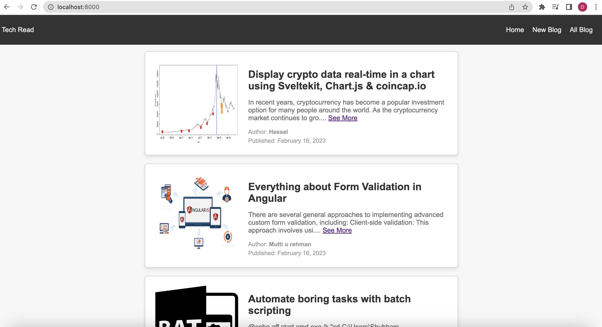
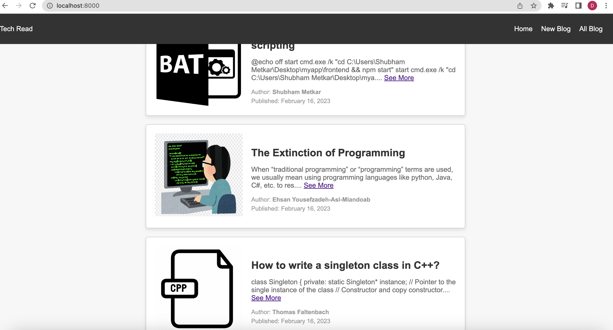
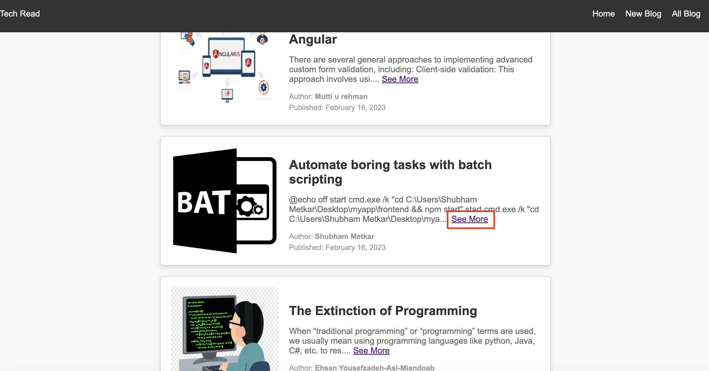
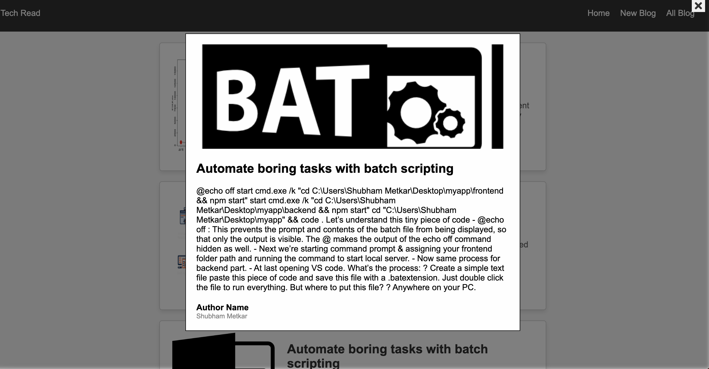
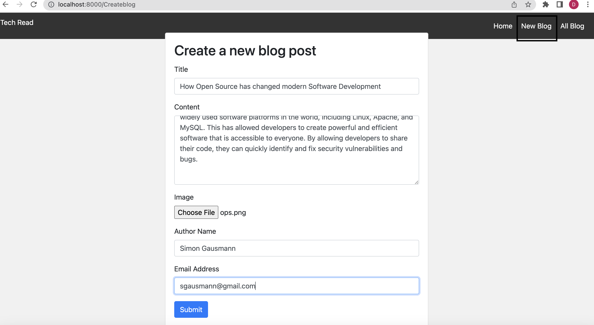
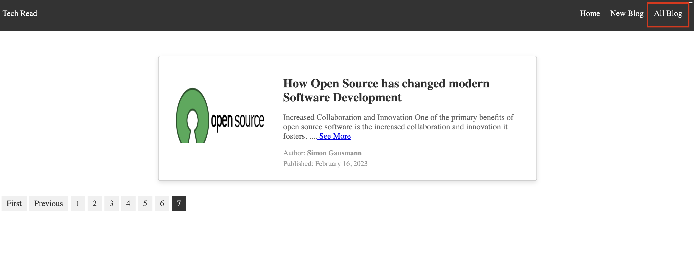

# blog-post-application

A blog-post application to create and post new blogs

The 'TechRead' application is one of a kind application that allows you to read, write and publish technical blogs online.

# Requirements

Blog Application that shows

1. Main Page with the top 5 Blogs
2. Link to create a New Post for Blog with title, Description and Image
3. All blogs page having list of blogs with paging feature

# Tech Stack

1. CodeIgniter Framework(v 3.1.10)
2. PHP
3. MySQL

# Installation

1. Clone the files and add them to your root folder. If you're using xampp, the location would be Applications/XAMPP/htdocs
2. Open the terminal and cd into the root folder and run the collowing command " php -S localhost:8000"

# Main functional modules

1. User can view the first 5 blogs on the main page

-  
- 

2. See More functionality to open up a dialog box to view the full article/blog

-  
- 

3. Link to create a new blog and view all blogs from the Home Page

- 

4. The blog is visible in the "All Blogs" section. It also has pager functionality for navigation

- 

# Future Improvements

To display the most recently added blog on the top of the HomePage

Like functionality on blog
 
Searching for a particular blog/article

